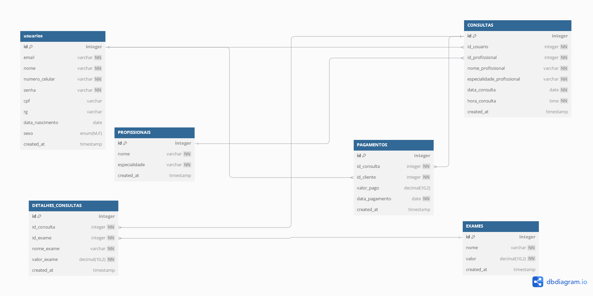

# Funcionamento do Programa e Fluxo do Banco de Dados

O sistema de gerenciamento de consultas e exames em uma clínica oftalmológica é estruturado através de um banco de dados que organiza e conecta informações dos usuários, profissionais, exames, consultas e pagamentos. Abaixo está a descrição do fluxo de dados e como as tabelas interagem entre si:

## 1. Registro de Usuário
- Quando um novo usuário se registra, suas informações (nome, e-mail, número de celular e senha) são armazenadas na tabela `usuarios`.
- Este registro inicial não inclui dados adicionais como CPF, RG, data de nascimento ou sexo. Esses campos são complementados posteriormente pelo usuário na seção de perfil.

## 2. Atualização do Perfil
- Após o registro, o usuário pode acessar sua seção de perfil para adicionar ou editar informações complementares como CPF, RG, data de nascimento e sexo. Essas informações são armazenadas na mesma tabela `usuarios`.

## 3. Marcação de Consultas
- Quando o usuário decide marcar uma consulta, o sistema apresenta uma lista de profissionais disponíveis (armazenados na tabela `PROFISSIONAIS`). O usuário escolhe um profissional, data e hora para a consulta.
- Ao confirmar a consulta, os dados são inseridos na tabela `CONSULTAS`, que mantém uma relação com a tabela `usuarios` (para identificar quem está agendando a consulta) e com a tabela `PROFISSIONAIS` (para identificar qual profissional será consultado).

## 4. Registro de Detalhes da Consulta
- Após a consulta, podem ser realizados exames relacionados. Os detalhes sobre quais exames foram feitos são registrados na tabela `DETALHES_CONSULTAS`, que se relaciona tanto com a tabela `CONSULTAS` (para vincular os exames à consulta específica) quanto com a tabela `EXAMES` (para armazenar informações sobre os exames realizados, como nome e valor).

## 5. Pagamentos
- Embora a funcionalidade de pagamento ainda não tenha sido implementada, a tabela `PAGAMENTOS` está pronta para registrar informações sobre os pagamentos feitos pelos usuários em relação às consultas. Essa tabela se relaciona com `CONSULTAS` (para identificar qual consulta está sendo paga) e com `usuarios` (para registrar qual usuário fez o pagamento).

## Estrutura do Banco de Dados
As seguintes tabelas são utilizadas para organizar os dados:

```sql
CREATE database IF NOT EXISTS Login_site;

use Login_site;

CREATE TABLE IF NOT EXISTS usuarios (
    id INT AUTO_INCREMENT PRIMARY KEY,
    email VARCHAR(255) NOT NULL UNIQUE,
    nome VARCHAR(255) NOT NULL,
    numero_celular VARCHAR(20) NOT NULL UNIQUE,
    senha VARCHAR(255) NOT NULL,
    cpf VARCHAR(20)  UNIQUE,
    rg VARCHAR(20)  UNIQUE,
    data_nascimento DATE,
    sexo ENUM('M', 'F'),
    created_at TIMESTAMP DEFAULT CURRENT_TIMESTAMP
);

CREATE TABLE IF NOT EXISTS PROFISSIONAIS (
    id INT AUTO_INCREMENT PRIMARY KEY,
    nome VARCHAR(255) NOT NULL,
    especialidade VARCHAR(255) NOT NULL,
    created_at TIMESTAMP DEFAULT CURRENT_TIMESTAMP
);

CREATE TABLE IF NOT EXISTS EXAMES (
    id INT AUTO_INCREMENT PRIMARY KEY,
    nome VARCHAR(255) NOT NULL,
    valor DECIMAL(10,2) NOT NULL,
    created_at TIMESTAMP DEFAULT CURRENT_TIMESTAMP
);

CREATE TABLE IF NOT EXISTS CONSULTAS (
    id INT AUTO_INCREMENT PRIMARY KEY,
    id_usuario INT NOT NULL,
    id_profissional INT NOT NULL,
    nome_profissional VARCHAR(255) NOT NULL,
    especialidade_profissional VARCHAR(255) NOT NULL,
    data_consulta DATE NOT NULL,
    hora_consulta TIME NOT NULL,
    created_at TIMESTAMP DEFAULT CURRENT_TIMESTAMP,
    FOREIGN KEY (id_usuario) REFERENCES usuarios(id),
    FOREIGN KEY (id_profissional) REFERENCES PROFISSIONAIS(id)
);

CREATE TABLE IF NOT EXISTS DETALHES_CONSULTAS (
    id INT AUTO_INCREMENT PRIMARY KEY,
    id_consulta INT NOT NULL,
    id_exame INT NOT NULL,
    nome_exame VARCHAR(255) NOT NULL,
    valor_exame DECIMAL(10,2) NOT NULL,
    created_at TIMESTAMP DEFAULT CURRENT_TIMESTAMP,
    FOREIGN KEY (id_consulta) REFERENCES CONSULTAS(id),
    FOREIGN KEY (id_exame) REFERENCES EXAMES(id)
);

CREATE TABLE IF NOT EXISTS PAGAMENTOS (
    id INT AUTO_INCREMENT PRIMARY KEY,
    id_consulta INT NOT NULL,
    id_cliente INT NOT NULL,
    valor_pago DECIMAL(10,2),
    data_pagamento DATE NOT NULL,
    created_at TIMESTAMP DEFAULT CURRENT_TIMESTAMP,
    FOREIGN KEY (id_consulta) REFERENCES CONSULTAS(id),
    FOREIGN KEY (id_cliente) REFERENCES usuarios(id)
);
```
# Exemplo de Inserção de Dados

Os dados dos usuários e profissionais podem ser inseridos como mostrado a seguir:

```sql
INSERT INTO usuarios (email, nome, numero_celular, senha, cpf, rg, data_nascimento, sexo)
VALUES ('joao.silva@example.com', 'João Silva', '11987654321', 'senhaSegura123', '12345678909', '123456789', '1990-05-15', 'M');

INSERT INTO PROFISSIONAIS (nome, especialidade) VALUES 
('Dr. João Silva', 'Oftalmologista'),
('Dra. Maria Oliveira', 'Pediatra'),
('Dr. Carlos Santos', 'Cardiologista'),
('Dra. Ana Pereira', 'Dermatologista'),
('Dr. Lucas Almeida', 'Neurologista');

INSERT INTO EXAMES (nome, valor) VALUES 
('Exame de Vista', 150.00),
('Ultrassonografia', 200.50),
('Hemograma Completo', 80.00),
('Exame de Sangue', 120.75),
('Raios X', 90.00);

```

# Conclusão

Esse fluxo de dados e a estrutura do banco de dados permitem um gerenciamento eficiente das informações dos usuários, agendamentos de consultas, realização de exames e registro de pagamentos, formando um sistema integrado para a clínica oftalmológica.